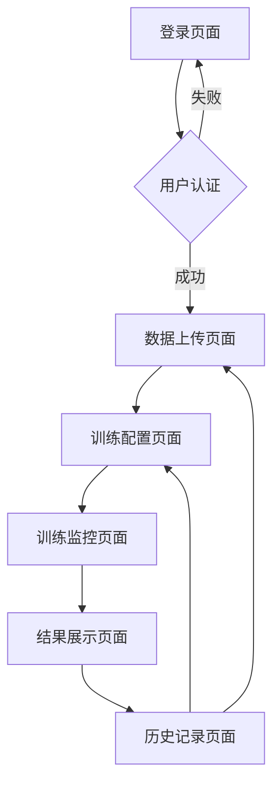

## 1. 产品概述

Mamformer纸张白度预测系统是一个基于深度学习的工业级Web应用，通过集成Mamba和Transformer架构的Mamformer模型，实现纸张生产过程中白度指标的精准预测。系统为造纸工程师和质量控制人员提供直观的模型训练、预测和可视化工具，帮助优化生产工艺参数，提升产品质量稳定性。

目标用户包括造纸厂工艺工程师、质量控制人员、数据分析师等需要预测和优化纸张白度指标的专业人员。

## 2. 核心功能

### 2.1 用户角色

| 角色 | 注册方式 | 核心权限 |
|------|----------|----------|
| 普通用户 | 邮箱注册 | 上传数据、训练模型、查看结果 |
| 高级用户 | 管理员分配 | 批量训练、模型对比、参数调优 |
| 管理员 | 系统预设 | 用户管理、系统配置、数据备份 |

### 2.2 功能模块

系统包含以下核心页面：
1. **数据上传页面**：CSV文件上传、数据预览、格式验证
2. **训练配置页面**：超参数设置、模型配置、训练任务提交
3. **训练监控页面**：实时进度、损失曲线、性能指标
4. **结果展示页面**：预测结果、可视化图表、模型评估
5. **历史记录页面**：训练历史、模型对比、结果下载

### 2.3 页面详情

| 页面名称 | 模块名称 | 功能描述 |
|----------|----------|----------|
| 数据上传页面 | 文件上传 | 支持拖拽上传CSV文件，显示上传进度 |
| 数据上传页面 | 数据预览 | 表格形式展示前100行数据，支持列筛选 |
| 数据上传页面 | 格式验证 | 自动检测数据格式，提示缺失值和异常值 |
| 训练配置页面 | 基本配置 | 设置序列长度、特征数量、训练轮次等基础参数 |
| 训练配置页面 | 模型配置 | 配置模型维度、层数、注意力头数等架构参数 |
| 训练配置页面 | 训练配置 | 设置学习率、批次大小、集成模型数量等训练参数 |
| 训练监控页面 | 实时进度 | 显示当前训练轮次、剩余时间、完成百分比 |
| 训练监控页面 | 损失曲线 | 实时绘制训练和验证损失曲线 |
| 训练监控页面 | 性能指标 | 显示R²、RMSE、MAE等关键评估指标 |
| 结果展示页面 | 预测对比 | 展示真实值与预测值的时序对比图 |
| 结果展示页面 | 散点图 | 显示预测值与真实值的相关性散点图 |
| 结果展示页面 | 残差分析 | 展示残差分布直方图和统计信息 |
| 结果展示页面 | 指标总结 | 汇总显示所有评估指标和模型配置信息 |
| 历史记录页面 | 训练历史 | 列表展示所有训练任务的基本信息 |
| 历史记录页面 | 模型对比 | 支持多模型性能指标对比分析 |
| 历史记录页面 | 结果下载 | 提供模型文件、预测结果、图表的下载功能 |

## 3. 核心流程

### 普通用户流程
1. 用户登录系统后进入数据上传页面
2. 上传包含纸张生产参数的CSV数据文件
3. 系统自动验证数据格式并显示预览
4. 进入训练配置页面设置模型参数
5. 提交训练任务并跳转到监控页面
6. 实时查看训练进度和性能指标
7. 训练完成后查看详细的预测结果和可视化图表
8. 在历史记录页面管理之前的训练任务

### 高级用户流程
高级用户除普通用户功能外，还可：
1. 使用高级参数调优功能
2. 批量提交多个训练任务
3. 对比不同模型的性能表现
4. 导出详细的实验报告

## 4. 用户界面设计

### 4.1 设计风格
- **主色调**：科技蓝 (#1E88E5) 搭配白色背景
- **辅助色**：成功绿 (#4CAF50)、警告橙 (#FF9800)、错误红 (#F44336)
- **按钮样式**：圆角矩形，悬停效果，主要操作用实心按钮
- **字体选择**：中文使用思源黑体，英文使用Roboto，字号12-16px
- **布局风格**：卡片式布局，左侧导航栏，右侧内容区域
- **图标风格**：使用Material Design图标库，线性图标为主

### 4.2 页面设计概览

| 页面名称 | 模块名称 | UI元素 |
|----------|----------|--------|
| 数据上传页面 | 文件上传 | 拖拽区域带虚线边框，上传按钮居中显示，支持多文件选择 |
| 数据上传页面 | 数据预览 | 响应式表格，支持列排序和筛选，异常值高亮显示 |
| 训练配置页面 | 参数配置 | 分组表单布局，滑块和数字输入框结合，实时验证提示 |
| 训练监控页面 | 进度展示 | 圆形进度条配合百分比文字，实时更新的曲线图表 |
| 结果展示页面 | 图表展示 | 全屏可放大的交互式图表，支持数据点悬停显示详情 |
| 历史记录页面 | 记录列表 | 表格形式展示，支持分页和搜索，操作按钮悬浮显示 |

### 4.3 响应式设计
- **桌面优先**：默认适配1920x1080分辨率
- **平板适配**：768px以上屏幕保持完整功能
- **手机适配**：小于768px时转为垂直布局，简化操作流程
- **触摸优化**：按钮和交互元素最小44px触摸区域

### 4.4 数据可视化指导
- **图表类型**：时序图使用折线图，相关性使用散点图，分布使用直方图
- **颜色方案**：真实值蓝色，预测值红色，置信区间半透明填充
- **交互功能**：支持缩放、平移、数据点悬停、图例点击切换
- **导出选项**：支持PNG、SVG、CSV格式导出