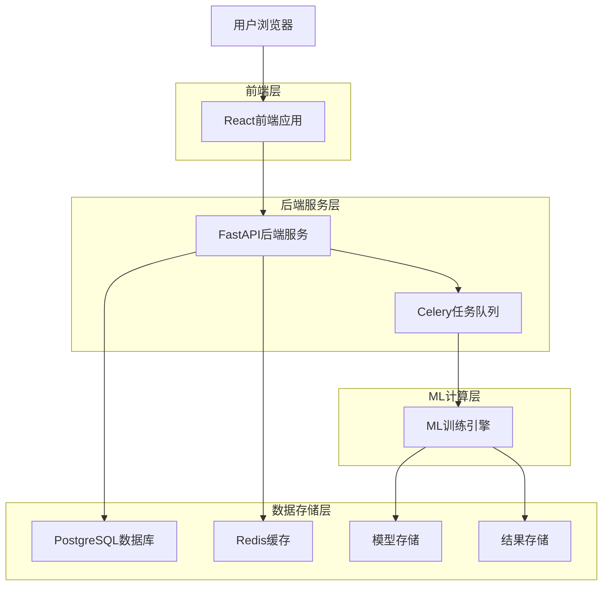
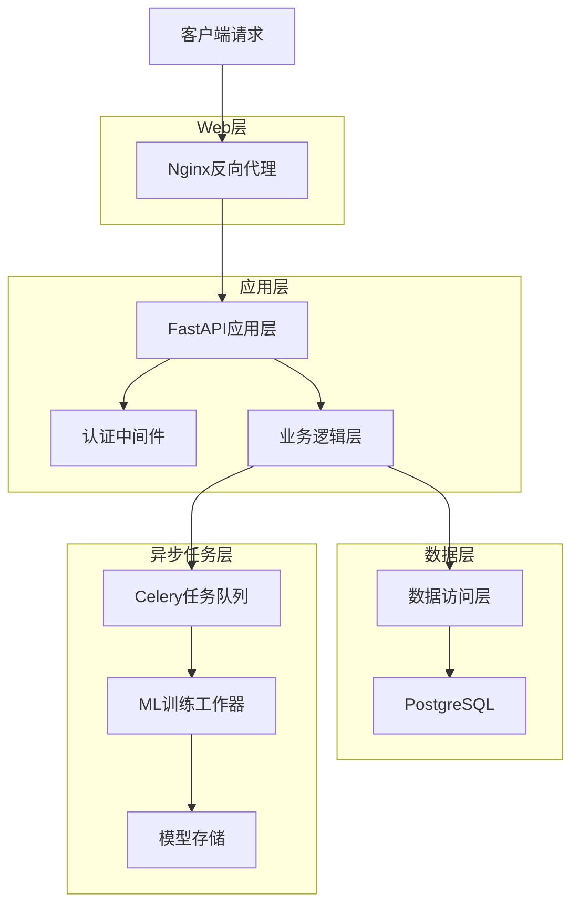
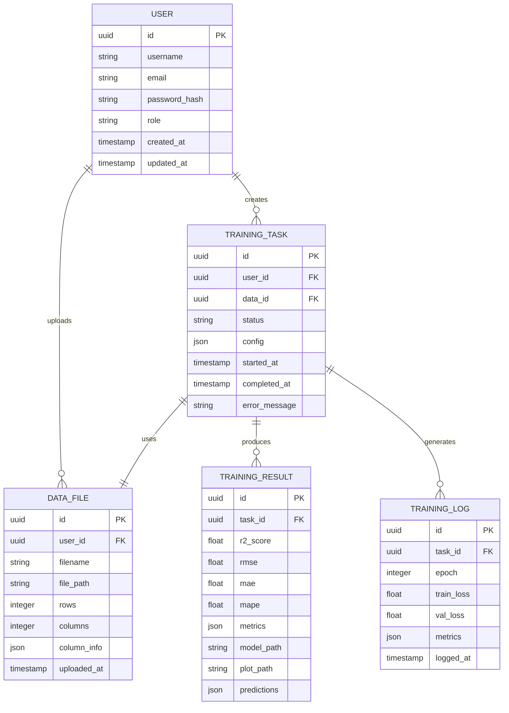

## 1. 架构设计



## 2. 技术栈描述

- **前端**：React@18 + TypeScript + Vite + Tailwind CSS + Chart.js
- **初始化工具**：vite-init
- **后端**：FastAPI@0.104 + Python@3.9 + Celery@5.3 + SQLAlchemy@2.0
- **数据库**：PostgreSQL@15 + Redis@7.2
- **机器学习**：PyTorch@2.1 + scikit-learn@1.3 + pandas@2.0
- **部署**：Docker + Docker Compose + Nginx

## 3. 路由定义

| 路由 | 用途 |
|------|------|
| / | 首页，系统介绍和快速入口 |
| /login | 登录页面，用户身份验证 |
| /dashboard | 主控制台，显示系统概览 |
| /data-upload | 数据上传页面，CSV文件上传和预览 |
| /training-config | 训练配置页面，模型参数设置 |
| /training-monitor/:id | 训练监控页面，实时查看训练进度 |
| /results/:id | 结果展示页面，查看训练结果和图表 |
| /history | 历史记录页面，管理训练任务 |
| /api/auth/* | 认证相关API接口 |
| /api/data/* | 数据管理API接口 |
| /api/training/* | 训练任务API接口 |
| /api/results/* | 结果查询API接口 |

## 4. API定义

### 4.1 认证相关API

```
POST /api/auth/login
```

请求参数：
| 参数名 | 参数类型 | 是否必需 | 描述 |
|--------|----------|----------|------|
| username | string | 是 | 用户名或邮箱 |
| password | string | 是 | 密码（明文传输，HTTPS加密） |

响应参数：
| 参数名 | 参数类型 | 描述 |
|--------|----------|------|
| access_token | string | JWT访问令牌 |
| token_type | string | 令牌类型（Bearer） |
| expires_in | integer | 令牌有效期（秒） |

### 4.2 数据上传API

```
POST /api/data/upload
```

请求参数：
| 参数名 | 参数类型 | 是否必需 | 描述 |
|--------|----------|----------|------|
| file | file | 是 | CSV格式数据文件 |
| description | string | 否 | 数据描述信息 |

响应参数：
| 参数名 | 参数类型 | 描述 |
|--------|----------|------|
| data_id | string | 数据文件唯一标识 |
| filename | string | 原始文件名 |
| rows | integer | 数据行数 |
| columns | array | 列名列表 |
| preview | array | 前10行数据预览 |

### 4.3 训练任务API

```
POST /api/training/create
```

请求参数：
| 参数名 | 参数类型 | 是否必需 | 描述 |
|--------|----------|----------|------|
| data_id | string | 是 | 数据文件ID |
| config | object | 是 | 训练配置参数 |

配置参数：
| 参数名 | 参数类型 | 默认值 | 描述 |
|--------|----------|--------|------|
| seq_len | integer | 12 | 序列长度 |
| d_model | integer | 64 | 模型维度 |
| n_layers | integer | 2 | 网络层数 |
| dropout | float | 0.3 | 丢弃率 |
| lr | float | 0.001 | 学习率 |
| batch_size | integer | 32 | 批次大小 |
| epochs | integer | 400 | 训练轮次 |
| top_k | integer | 12 | 特征选择数量 |
| n_models | integer | 5 | 集成模型数量 |

### 4.4 训练进度API

```
GET /api/training/progress/{training_id}
```

响应参数：
| 参数名 | 参数类型 | 描述 |
|--------|----------|------|
| status | string | 训练状态（pending/running/completed/failed） |
| progress | float | 训练进度（0-100） |
| current_epoch | integer | 当前训练轮次 |
| total_epochs | integer | 总训练轮次 |
| loss_history | array | 损失值历史 |
| metrics | object | 当前性能指标 |

## 5. 服务器架构图



## 6. 数据模型

### 6.1 数据模型定义



### 6.2 数据定义语言

用户表（users）
```sql
-- 创建用户表
CREATE TABLE users (
    id UUID PRIMARY KEY DEFAULT gen_random_uuid(),
    username VARCHAR(50) UNIQUE NOT NULL,
    email VARCHAR(255) UNIQUE NOT NULL,
    password_hash VARCHAR(255) NOT NULL,
    role VARCHAR(20) DEFAULT 'user' CHECK (role IN ('user', 'advanced', 'admin')),
    created_at TIMESTAMP WITH TIME ZONE DEFAULT NOW(),
    updated_at TIMESTAMP WITH TIME ZONE DEFAULT NOW()
);

-- 创建索引
CREATE INDEX idx_users_username ON users(username);
CREATE INDEX idx_users_email ON users(email);
```

数据文件表（data_files）
```sql
-- 创建数据文件表
CREATE TABLE data_files (
    id UUID PRIMARY KEY DEFAULT gen_random_uuid(),
    user_id UUID NOT NULL REFERENCES users(id) ON DELETE CASCADE,
    filename VARCHAR(255) NOT NULL,
    file_path VARCHAR(500) NOT NULL,
    rows INTEGER NOT NULL,
    columns INTEGER NOT NULL,
    column_info JSONB NOT NULL,
    uploaded_at TIMESTAMP WITH TIME ZONE DEFAULT NOW()
);

-- 创建索引
CREATE INDEX idx_data_files_user_id ON data_files(user_id);
CREATE INDEX idx_data_files_uploaded_at ON data_files(uploaded_at DESC);
```

训练任务表（training_tasks）
```sql
-- 创建训练任务表
CREATE TABLE training_tasks (
    id UUID PRIMARY KEY DEFAULT gen_random_uuid(),
    user_id UUID NOT NULL REFERENCES users(id) ON DELETE CASCADE,
    data_id UUID NOT NULL REFERENCES data_files(id) ON DELETE CASCADE,
    status VARCHAR(20) DEFAULT 'pending' CHECK (status IN ('pending', 'running', 'completed', 'failed')),
    config JSONB NOT NULL,
    started_at TIMESTAMP WITH TIME ZONE,
    completed_at TIMESTAMP WITH TIME ZONE,
    error_message TEXT,
    created_at TIMESTAMP WITH TIME ZONE DEFAULT NOW()
);

-- 创建索引
CREATE INDEX idx_training_tasks_user_id ON training_tasks(user_id);
CREATE INDEX idx_training_tasks_status ON training_tasks(status);
CREATE INDEX idx_training_tasks_created_at ON training_tasks(created_at DESC);
```

训练结果表（training_results）
```sql
-- 创建训练结果表
CREATE TABLE training_results (
    id UUID PRIMARY KEY DEFAULT gen_random_uuid(),
    task_id UUID UNIQUE NOT NULL REFERENCES training_tasks(id) ON DELETE CASCADE,
    r2_score FLOAT NOT NULL,
    rmse FLOAT NOT NULL,
    mae FLOAT NOT NULL,
    mape FLOAT NOT NULL,
    metrics JSONB NOT NULL,
    model_path VARCHAR(500) NOT NULL,
    plot_path VARCHAR(500),
    predictions JSONB,
    created_at TIMESTAMP WITH TIME ZONE DEFAULT NOW()
);

-- 创建索引
CREATE INDEX idx_training_results_task_id ON training_results(task_id);
CREATE INDEX idx_training_results_r2_score ON training_results(r2_score DESC);
```

### 6.3 数据库权限设置

```sql
-- 基本权限设置
GRANT SELECT ON ALL TABLES IN SCHEMA public TO anon;
GRANT ALL PRIVILEGES ON ALL TABLES IN SCHEMA public TO authenticated;

-- 特定表权限
GRANT SELECT ON users TO anon;
GRANT ALL PRIVILEGES ON users TO authenticated;
GRANT ALL PRIVILEGES ON data_files TO authenticated;
GRANT ALL PRIVILEGES ON training_tasks TO authenticated;
GRANT ALL PRIVILEGES ON training_results TO authenticated;
```